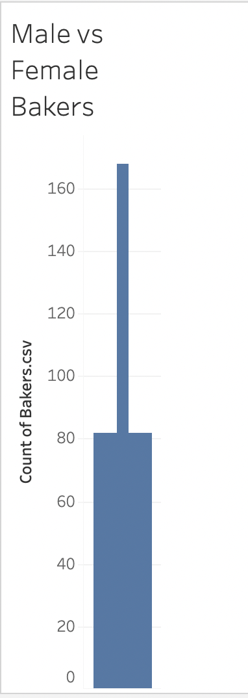
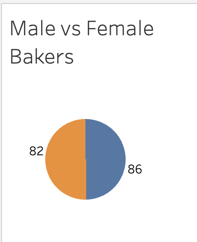

# Tableau Trailhead Basics — Assignment Submission

This repository contains my completed work for the **Tableau Trailhead Modules & Data Storytelling Viz** assignment, including required screenshots, a published Tableau Public visualization link, and a written reflection connecting course concepts to real-world applications.

## Trailhead Module Completion

### **1. Data Storytelling with Tableau Public**
### **2. The Tableau Data Model**

## Tableau Public Visualization

### **Screenshots**

Both these graphs I compared male to female bakers.

**Public URL to my viz:**  
[Assignment 6 Tableau Visualization](https://public.tableau.com/app/profile/anita.liu7514/viz/Assignment6_17640451598120/Sheet1#1)

## Reflection (4–6 sentences)

One important principle from the **Data Storytelling with Tableau Public** module is that an effective visualization should focus on a single, clear message that a viewer can understand within a few seconds. This influenced my design choices by pushing me to simplify the layout and choose visual elements that naturally highlight the trend I wanted to emphasize. From **The Tableau Data Model** module, a key concept I learned was the difference between **relationships** and **joins**, and how relationships preserve the proper level of detail by combining data only when necessary. This is especially important when working with real-world datasets that contain multiple tables, because the wrong join can duplicate rows and distort results. In a healthcare setting, Tableau’s flexible data model and storytelling tools could help track patient outcomes by linking visits, lab results, and diagnoses while avoiding data duplication, allowing clinicians or administrators to quickly identify patterns in quality or utilization.
